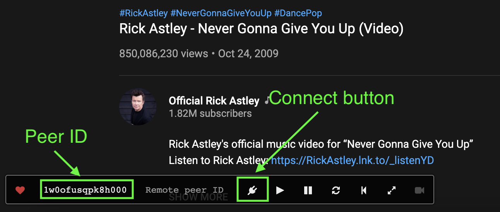
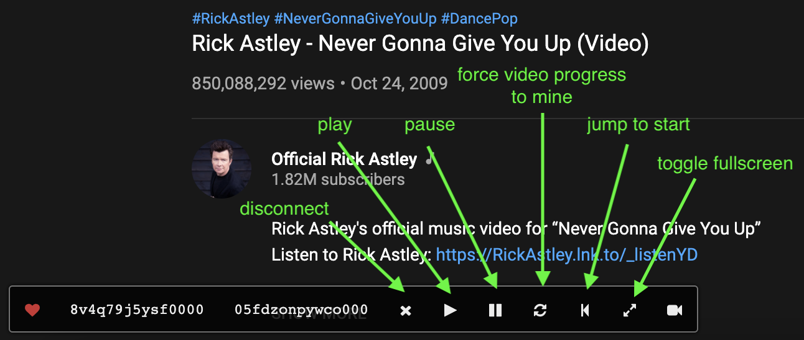

# Coplay

Synchronize online video playing between peers.

## Introduction

Coplay connects two users who are on the same video site and let them control both video players simultaneously.

Coplay works on Youku, Sohu TV, Tencent Video, Tudou, iQiyi, YouTube, AcFun, bilibili, LETV and Vimeo.

This is a forked version of the [original by @Justineo](https://github.com/Justineo/coplay). Improvements over the original version include

* Use up-to-date peer.js library and the official peer.js server so that the initial connection is more reliable

## Install

If you don't want to install it from a store, download from [releases](https://github.com/hwang381/coplay/releases) for either the Chrome/Firefox or the Safari (notarized) versions

## Use

1. The two users visit the same video page on one of the supported video sites
   
2. One of the users enters the peer ID of another user and click the connect button

3. After connection is established (indicated by the disconnect button), both users can play, pause, synchronize video progress, and toggle full screen

  **Video players are only synchronized if users use the button on the Coplay control bar**

On HTTPS sites, users can use video calls to video chat with each other while watching videos. *You might need to put your headphones on while video chatting because Coplay has no <abbr>AEC</abbr>(acoustic echo cancellation) support. (Help needed)*

## Options

* Custom server - You can specify a custom PeerJS server.
  
* Key - Provide additional authorization key to your custom server if necessary.
  
* Auto-activate - If Coplay detected supported video players on applicable sites, it will be activated automatically.

## FAQ

* Why doesn't my Peer ID show up on YouTube?
  
YouTube uses HTTPS but PeerJS (the WebRTC service which Coplay relies on) makes some HTTP requests, which are blocked by browsers' security policies.

You can either enable default HTTPS server in the options, or set up your custom PeerJS server with HTTPS support.

## Development

Use `npm run pack` to build Chrome extension (which can also be used on Firefox)

Use `npm run pack-safari` to build Safari web extension app, requires macOS Big Sur and latest Xcode
